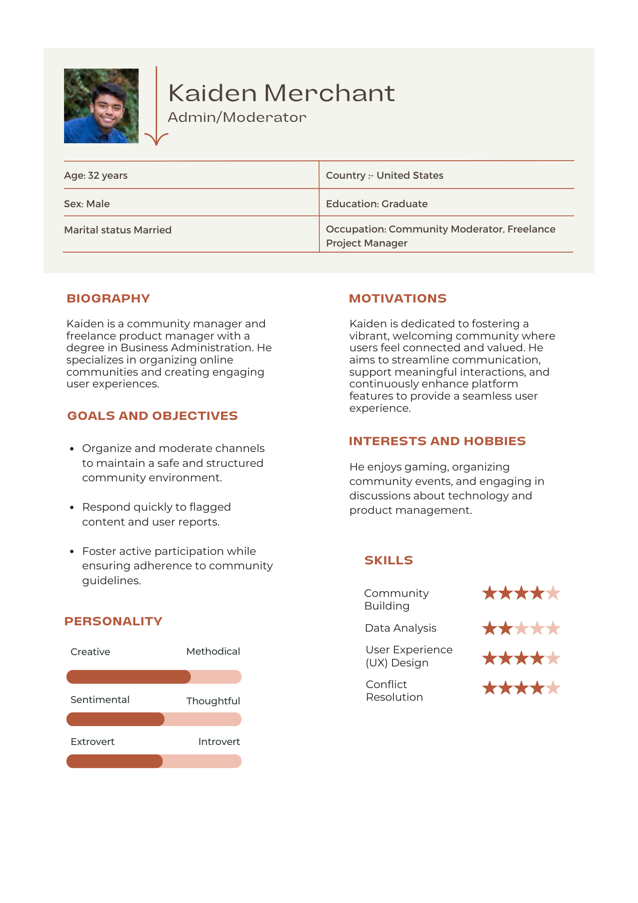
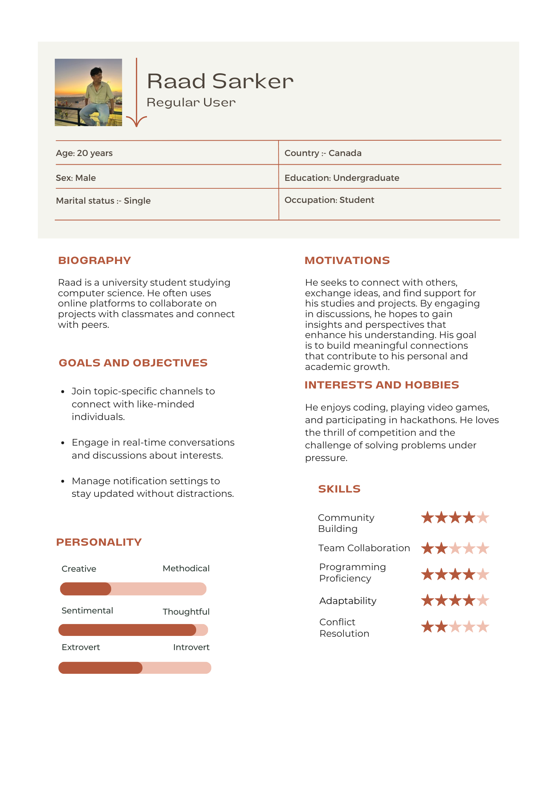
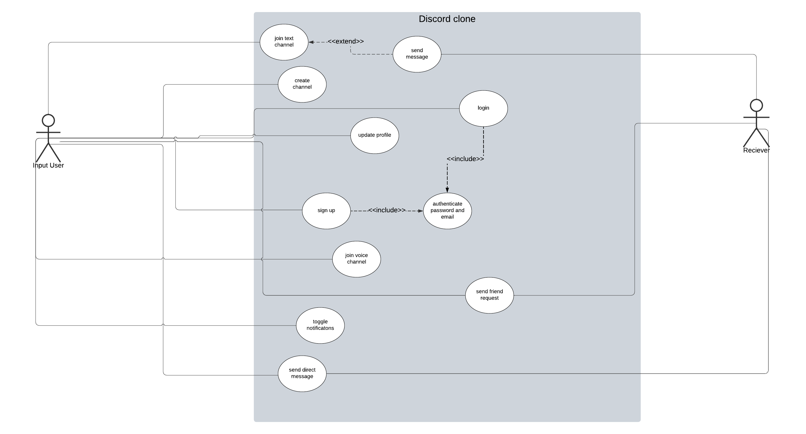

# Discord Clone
## Description
The Discord clone project focuses on building a versatile online platform that allows seamless communication for individuals and groups. The application will support essential functions including channels, private messaging, and user management. The platform is designed to support a wide range of users while also creating an accessible web interface. It will also enable structured converstaions across distinct channels and group management. We aim to establish the given software design patterns to ensure that this application is both adaptable and maintanable.
### Features
1. Real-Time Messaging: Users can send and receive messages instantly within designated channels, supporting small group discussions
2. Channel Organization: Users can create and join channels focused on specific topics, allowing for organized communication within smaller groups
3. Basic User Management: Users will be able to sign up, log in, and create simple profiles, including the ability to change display names
4. User Interaction Commands: Users can utilize basic commands for actions like joining channels and updating profile names, enhancing usability without extensive UI requirements
5. Notifications: Users can enable/disable Notifications for new messages within active channels to keep users updated on conversations without complex notification management.

## Requirements Analysis and Development
### User Requirements
- Dynamic Communication: Users need to communicate in real-time, access channels easily, and have control over their message notifications to avoid distraction
- Profile and Settings Management: Users can update their personal settings, manage visibility preferences, and set temporary statuses
- Simple Commands for Quick Actions: Users should be able to use text-based commands to join channels, change settings, and interact with the platform efficiently
- Audio Channel: Users will be able to join a voice channel and talk with other users.
### Functional Requirements
- Messaging and Channel Operations: Enable real-time messaging that remains responsive as user count grows. Support seamless entry into different channels with notifications for new messages and mentions.
- Command Processing System: A system for interpreting and executing user commands without delay, creating a smoother user experience and reducing manual effort.
- Scalable Server Management: Control server usage to avoid excess resource consumption, ensuring that the platform can handle a growing user base with minimal lag.

### Non-functional Requirements
- High Performance: Users should experience minimal latency (ideally under 1 second) in messaging and command execution, even during peak usage times.
- Reliability: Maintain an uptime of at least 99.9% with minimal interruptions to ensure consistent access.
- Security: Protect user data through secure authentication and encrypted communication, preventing unauthorized access.
- Accessibility: Design for screen reader compatibility and provide accessible navigation options to ensure usability for all users.
- Usability: A straightforward, user-friendly interface that requires minimal guidance, allowing users to intuitively find settings and features.

### Environmental Requirements
- Automated Testing and Continuous Integration: Regular automated testing of features before deployment to ensure a bug-free, stable experience for users.
- Supported Browsers: The application should be compatible with multiple browsers -- at least Chrome, Safari, Firefox.

### Persona 1

### Persona 2

### Use Case Diagram

#### UC1: Create Channel
- Primary Actor: Input User
- Description: The Sender initiaties the creation of a new channel within a server.
- Pre-Condition: The Sender has the permissions needed to create channels in the desired server.
- Post-Condition: A new channel is created and visible to users with permission.

- Main Scenario:  
    1) The Sender desires to create a new channel and clicks "Create Channel" in the server channel list.
    2) The Sender is prompted to select channel name, settings, permissions.
    3) The Sender inputs the channel details.
    4) The new channel is created, and visible in the server's channel list, to those who have permission.

- Extensions:  
    1) Channel name is invalid. The user should be prompted to change the name and try again.
    2) Insufficient permissions. The user is notified they do not have the authority to create a channel.

#### UC2: Update Profile
- Primary Actor: Input User
- Description: The Sender is able to update their profile information including display name, profile picture, and "About Me".
- Pre-Condition: The Sender is logged into an account
- Post-Condition: The profile is updated with the desired changes for everyone on the app.

- Main Scenario:  
    1) The Sender navigates to their profile and clicks "Update Profile".
    2) The Sender updates the desired details.
    3) The Sender confirms and saves the changes.
    4) The updated profile is visible everyone on the app.

- Extensions:  
    1) The updated information is in an incorrect format. The Sender should be notified that the information is in the wrong format. This includes invalid text fields and profile picture.

#### UC3: Login

- Primary Actor: Input User
- Description: The Sender enters their email and password to log into their account.
- Pre-Condition: The Sender already has a registered account.
- Post-Condition: The Sender is logged in to their account.

- Main Scenario  
    1) The Sender opens the application's login page.
    2) The Sender enters their email and password.
    3) The Application verifies if the email and password match a registered account (Using UC7).
    4) The Sender is logged into their account.

- Extensions:  
    1) Incorrect Login Information. The Application displays an error message, prompting the sender to re-enter their information.

#### UC4: Join Text Channel

- Primary Actor: Input User
- Description: The Sender wishes to participate in a text channel.
- Pre-Condition: The Sender is logged into an account and has permissions to join the channel.
- Post-Condition: The Sender is added to the text channel and can view and send messages.

- Main Scenario:  
    1) The Sender selects a channel from the list
    2) The System connects them to the channel if they have permissions for the channel.
    3) The Sender can now view messages, and send messages (Using Use Case #5).

- Extensions:  
    1) Channel is unavailable. The Sender is prompted that the channel cannot be accessed at this moment.
    2) Invalid Permissions. The Sender is prompted that they do not have permissions to access the channel.

#### UC5: Send Message

- Primary Actor: Input User
- Description: The sender sends a message in the text channel, and all other members in the channel can view it.
- Pre-Condition: The Sender is connected to the channel and has permission to send messages.
- Post-Condition: The message is delievered in the channel, and all other members can see it.

- Main Scenario:  
    1) Sender types desired message in the channel's message field and clicks "Send".
    2) The System uploads the message to the channel.
    3) All other memebers in the channel can view the message.

- Extensions:  
    1) Invalid Permission. If the Sender does not have permissions to message in the channel, they will be notified, and the message will not be uploaded.

#### UC6: Sign Up

- Primary Actor: Input User (new user)
- Description: The user is able to enter their email, password and username to create a new account for the application.
- Pre-Condition: The user has an email, password, and desired username.
- Post-Condition: A new account for the application is created, and the user is logged in.

- Main Scenario:  
    1) The user opens the application and wants to create an account.
    2) The user enters their email, password, and username for the application.
    3) The application authenticates the information. (Using Use Case #7)
    4) A new account is created, and the user is able to use the app.

- Extensions:  
    1) Email is already Used. The user is notified the email is already being used for an account, and given the option to log in.
    2) Invalid Format. The User is notified the details are in the incorrect format, and prompted to try again.

#### UC7: Authenticate Email/Password
- Primary Actor: User
- Description: The User initiates the authentication process using an email and password to log into the platform.
- Pre-Condition: The User has previously registered an account with a valid email and password.
- Post-Condition: The User is logged in and granted access to their account.

- Main Scenario:  

    1) The User opens the login page and enters their email and password.
    2) The system verifies the entered email and password against stored user data.
    3) If the credentials are correct, the User is authenticated.
    4) The User is directed to the main application dashboard.

- Extensions: 

    1) Invalid credentials: The system notifies the User that the email or password is incorrect and prompts them to try again.
    2) Account locked: If multiple login attempts fail, the system locks the account and requires verification to unlock.

#### UC8: Join Voice Channel
- Primary Actor: User
- Description: The User initiates a request to join an existing voice channel.
- Pre-Condition: The User is logged in and has permission to join voice channels within the server.
- Post-Condition: The User is added to the voice channel and can communicate with others in the channel.

- Main Scenario:  

    1) The User navigates to the desired voice channel in the server.
    2) The User clicks “Join Voice Channel.”
    3) The system checks that the User has permission to join the voice channel.
    4) The User is connected to the voice channel and can begin voice communication.
- Extensions:  

    1) Insufficient permissions: The system notifies the User that they lack the required permissions to join the channel.
    2) Channel full: If the channel has reached its maximum capacity, the User is notified and unable to join.

#### UC9: Send Friend Request
- Primary Actor: User
- Description: The User sends a friend request to connect with another user on the platform.
- Pre-Condition: The User is logged in and has the other user's username or profile available.
- Post-Condition: A friend request is sent to the targeted user.

- Main Scenario:  

    1) The User navigates to the profile of the user they wish to add as a friend.
    2) The User clicks “Send Friend Request.”
    3) The system sends a friend request notification to the target user.
    4) The target user sees the friend request in their notifications.
- Extensions:  

    1) Already friends: The system notifies the User that they are already friends with this person.
    2) Friend request limit reached: If the User has reached the maximum friend request limit, they are notified accordingly.

#### UC10: Toggle Notifications
- Primary Actor: User
- Description: The User toggles notifications on or off for specific channels or the entire application.
- Pre-Condition: The User is logged in and has access to notification settings.
- Post-Condition: Notifications are toggled on or off as per the User’s choice.

- Main Scenario:  

    1) The User navigates to the notification settings menu.
    2) The User selects the desired channels or global setting to toggle notifications.
    3) The system updates the User’s notification settings accordingly.
    4) The User is informed of the successful update.
- Extensions:

    1) Invalid selection: If the User attempts to toggle notifications for a channel they don’t have access to, they are notified.
    2) Global notification restrictions: If the application has a restriction (e.g., admin-only notifications), the User is informed that only certain notifications can be disabled.

#### UC11: Send Direct Message
- Primary Actor: User
- Description: The User sends a direct message to another user on the platform.
- Pre-Condition: The User is logged in and has the recipient's username or is connected as a friend.
- Post-Condition: The direct message is sent, and the recipient is notified.

- Main Scenario:  

    1) The User navigates to their friend list or directly to the chat interface for the specific recipient.
    2) The User types the message in the message input field.
    3) The User clicks “Send,” and the message is delivered to the recipient.
    4) The recipient receives the message and is notified.
- Extensions:  

    1) Recipient unavailable: If the recipient is offline, the system stores the message and delivers it when they come online.
    2) Message delivery failed: If the system experiences issues, the User is notified that the message could not be sent and prompted to retry.